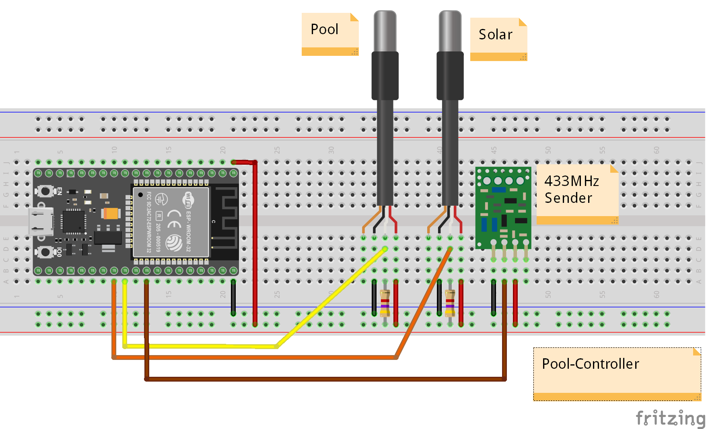

# Pool Controller

## Hardware

* ESP32 Controller
* Temperature Sensor Pool
* Temperature Sensor Solar
* 433MHz-Switches for Solar- and Pool-Pumps

## Configuration

PIN Usage:
* PIN_DS_SOLAR = 16; // Temp Solar
* PIN_DS_POOL  = 17; // Temp Pool
* PIN_RSSWITCH = 18; // für 433MHz Sender

## Breadboard

Source: [doc/Pool-Control.fzz](doc/Pool-Control.fzz)
